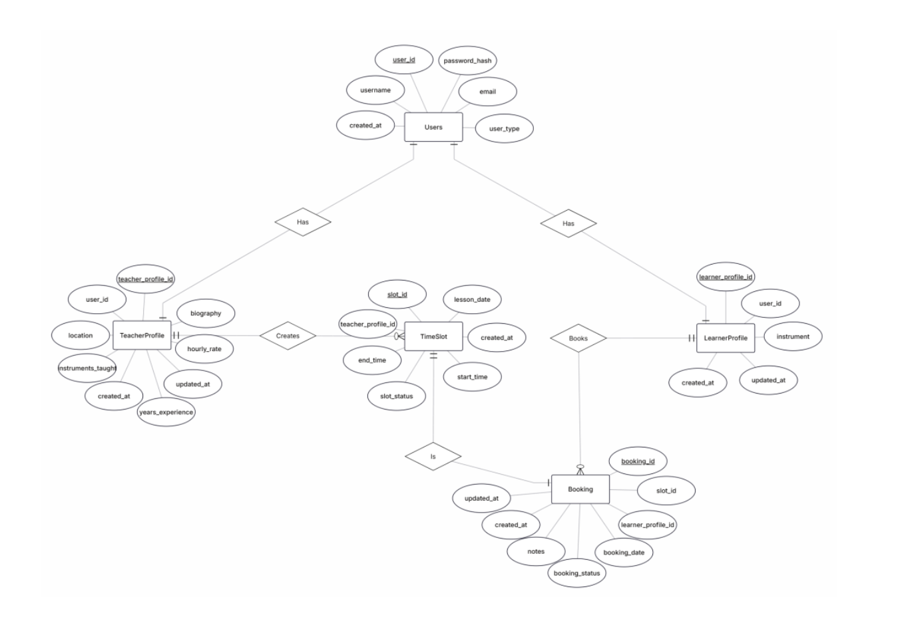

# Music Course Platform
## Software Engineering Project 1 — Group 5

## Team Members
| Name | Role |
|------|------|
| **Luo Ying** | Frontend Development, UI/UX Design (Figma), Modelling Diagram, Documentation |
| **Chen Yicheng** | Backend Development, DevOps, Technical Documentation |
| **Lu Liu** | Backend Development, Database Design, Technical Documentation |
| **Su Wai Phyoe** | Testing, Frontend Development, Documentation |

---

## Description

The Music Course Platform is a JavaFX desktop application that connects music teachers with learners. Teachers can manage their profiles and availability, while learners can search for teachers and book lessons.

---

## Documentation

- [Product Vision](document/Product%20Vision.pdf)
- [Project Plan](document/Software%20Engineering%20Project%20Plan.pdf)
- [User Stories](document/UserStories.md)
- [Design](document/Design.md)

---


## Getting Started

### Prerequisites

- **JDK 17+** — `java -version`
- **Apache Maven 3.6+** — `mvn -version`
- **MariaDB 10.6+** (default port: 3306)
- **Git**

### Installation & Setup

#### 1. Clone the Repository

```bash
git clone https://github.com/chenyicheng1998/MusicCoursePlatform.git
cd MusicCoursePlatform
```

#### 2. Configure Database Connection

Open `MusicCoursePlatform/src/main/java/dao/DatabaseConnection.java` and update lines 17–19 with your MariaDB credentials:

```java
private static final String URL = "jdbc:mariadb://localhost:3306/music_course_platform";
private static final String USER = "root";
private static final String PASSWORD = "your_password_here";
```

#### 3. Create the Database

In your MariaDB client, run:

```sql
SOURCE MusicCoursePlatform/database/schema.sql;
```

#### 4. Build the Project

```bash
cd MusicCoursePlatform
mvn clean compile
```

#### 5. Run the Application

```bash
mvn javafx:run
```

---

## Language Selection & Localization

The Music Course Platform supports **multilingual user interface** with the following languages:

| Language | Code | Text Direction |
|----------|------|----------------|
| English | `en` | LTR (Left-to-Right) |
| Chinese (中文) | `zh` | LTR |
| Arabic (العربية) | `ar` | RTL (Right-to-Left) |

### Switching Languages

1. Launch the application using `mvn javafx:run`
2. Look for the **language selector dropdown** in the navigation bar (top-right corner)
3. Select your preferred language from the dropdown menu
4. The UI will automatically update to display text in the selected language

### Running Localized Versions

The application automatically detects and applies the selected language. All UI elements including:
- Navigation menus
- Form labels and buttons
- Calendar and date formats
- Error and success messages
- Instrument names

...are dynamically localized based on your selection.

### Localization Architecture

The localization system uses Java's `ResourceBundle` framework with a singleton `LocalizationManager` class:

```
src/main/resources/i18n/
├── messages_en.properties    # English (default)
├── messages_zh.properties    # Chinese
└── messages_ar.properties    # Arabic
```

For detailed documentation on the localization framework, see:
- [Localization Framework Documentation](document/LOCALIZATION_FRAMEWORK.md)

---

## Testing & Code Coverage

To run all tests and generate the JaCoCo coverage report:

```bash
mvn clean test jacoco:report
```

The coverage report will be available at `target/site/jacoco/index.html`.

---

## CI/CD Pipeline (Jenkins)

The project uses a Jenkins pipeline defined in `Jenkinsfile`. It triggers automatically on commits to the `dev` branch and runs the following stages:

| Stage | Description |
|-------|-------------|
| Checkout | Clone latest code from GitHub |
| Build | Compile with Maven (`mvn clean compile`) |
| Run Tests | Execute JUnit tests (`mvn test`) |
| Generate JaCoCo Report | Produce code coverage report |
| Package Application | Build shaded JAR (`mvn package`) |
| Archive Artifacts | Save JAR files as build artifacts |
| Build Docker Image | Build Docker image from Dockerfile |
| Push to Docker Hub | Push image to `chenyicheng1998/music-course-platform` |

---

## Docker

The Docker image is available on Docker Hub:
**[chenyicheng1998/music-course-platform](https://hub.docker.com/repository/docker/chenyicheng1998/music-course-platform)**

```bash
docker pull chenyicheng1998/music-course-platform:latest
```

---

## Trello Boards

| Sprint | Scrum Master | Board | Status |
|--------|-------------|-------|--------|
| Sprint 1 | Chen Yicheng | [Sprint 1](https://trello.com/b/YnjfjBxd/sep1musiccourseplatform) | ✅ Done |
| Sprint 2 | Luo Ying | [Sprint 2](https://trello.com/b/IMIZmc7K/sep1musiccourseplatform-sprint2) | ✅ Done |
| Sprint 3 | Su Wai Phyoe | [Sprint 3](https://trello.com/b/B5AJ4wIm/sep1musiccourseplatform-sprint3) | ✅ Done |
| Sprint 4 | Liu Lu | [Sprint 4](https://trello.com/b/Rx627kZj/sep1musiccourseplatform-sprint4) | ✅ Done |
| Sprint 5 | Luo Ying | [Sprint 5](https://trello.com/b/gQ18ryeD/sep1musiccourseplatform-sprint5) | ✅ Done |

---

## Sprints Review

- [Sprint 1 Review](document/SprintReviewReports/Sprint_1_Review_Report.pdf)
- [Sprint 2 Review](document/SprintReviewReports/Sprint_2_Review_Report.pdf)
- [Sprint 3 Review](document/SprintReviewReports/Sprint_3_Review_Report.pdf)
- [Sprint 4 Review](document/SprintReviewReports/Sprint_4_Review_Report.pdf)
- [Sprint 5 Review](document/SprintReviewReports/Sprint_5_Review_Report.pdf)

### Diagrams

**Use Case Diagram (with Localization)** — [Music Course Platform – Use Case Diagram (PDF)](document/diagrams/Music%20Course%20Platform-Use%20Case%20Diagram.pdf)

**Database Schema**


**ER Diagram**

