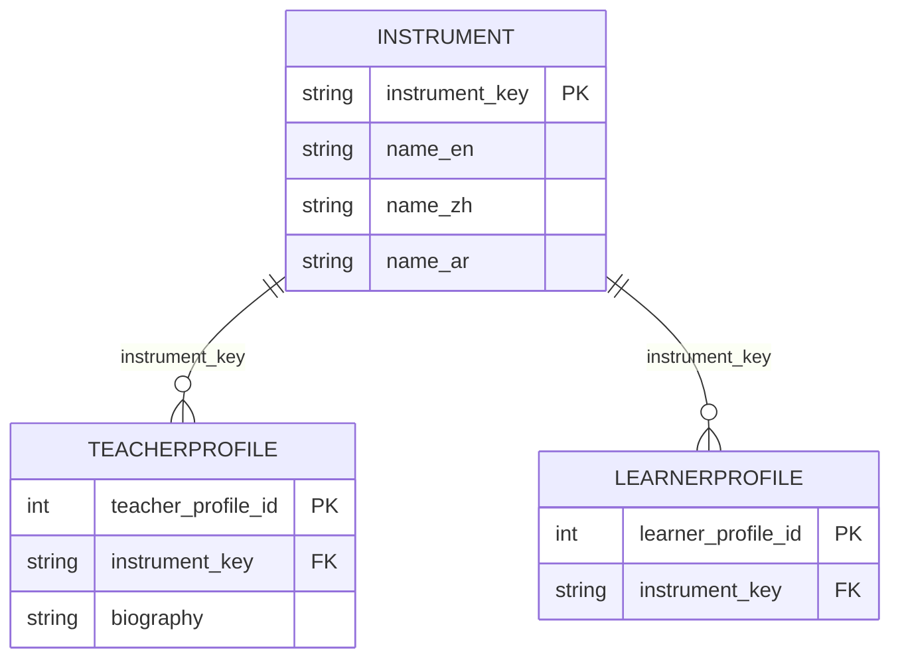

# Database Localization — Plan & Implementation Report

**Course:** OTP2 / Software Engineering Project  
**Sprint 6 deliverable:** Database localization strategy, schema, encoding, and validation notes.

---

## 1. Goals

| Requirement | How we address it |
|-------------|-------------------|
| Localization strategy for **database-stored** content | Store **language-neutral canonical keys** for translatable domain data; keep human-readable translations in the schema (reference table) and align the app with **ResourceBundles** for the active UI locale. |
| Schema & ERD for multilingual support | New **`INSTRUMENT`** catalogue; **`instrument_key`** foreign keys on **`TEACHERPROFILE`** and **`LEARNERPROFILE`**. |
| UTF-8 & locale | Database and tables use **`utf8mb4`** / **`utf8mb4_unicode_ci`**; session `SET NAMES utf8mb4`; JDBC to MariaDB transfers Unicode text correctly. |
| Retrieval & display across languages | DAOs read/write **keys**; **`LocalizationManager`** maps keys ↔ localized labels for combos and labels; filtering uses the canonical key so teachers are findable in any UI language. |

---

## 2. Localization strategy (database content)

### Problem

If we stored a single localized string (e.g. only `"钢琴"` or only `"Piano"`) in `TEACHERPROFILE`, then:

- A student browsing in English would not match a teacher who registered in Chinese.
- Reports and APIs would be ambiguous.

### Chosen approach: **canonical key + reference translations**

1. **`instrument_key`** — A **stable, lowercase English identifier** (`piano`, `guitar`, …) stored in profile tables. This is the value used in **JOINs**, **FK constraints**, and **filters**.

2. **`INSTRUMENT` table** — For each `instrument_key`, we store **official display names** in three columns: `name_en`, `name_zh`, `name_ar`. This documents the intended translation in the database and supports future server-side or reporting use.

3. **Application UI** — Screen text for the **current user locale** still comes from **`messages_*.properties`** (same keys as UI-only strings: `instrument.piano`, …). **`LocalizationManager`** provides:
   - `getInstrumentKey(localizedLabel)` — resolve combo selection to a key before save/query.
   - `getLocalizedInstrumentName(storedValue)` — show the correct label after load (supports legacy localized strings during transition).
   - `getAllInstrumentVariants(key)` — optional multi-locale matching if needed.

So: **persistence = canonical key**; **presentation = bundle for current locale**; **INSTRUMENT row = authoritative multilingual catalogue in the DB**.

---

## 3. Schema & ERD (multilingual-related parts)

### Entity–relationship (conceptual)

### DDL highlights (see `MusicCoursePlatform/database/schema.sql`)

- `CREATE DATABASE ... CHARACTER SET utf8mb4 COLLATE utf8mb4_unicode_ci`
- `INSTRUMENT(instrument_key, name_en, name_zh, name_ar)` — **PK = `instrument_key`**
- `TEACHERPROFILE.instrument_key` → `INSTRUMENT(instrument_key)`
- `LEARNERPROFILE.instrument_key` → `INSTRUMENT(instrument_key)`
- `biography`, `notes`, and other **free text** columns use **`TEXT`/`VARCHAR` with `utf8mb4`** so user-generated content in any script is stored safely.

---

## 4. Character encoding & JDBC

| Layer | Setting |
|-------|---------|
| MariaDB database | `utf8mb4` / `utf8mb4_unicode_ci` |
| Tables | `ENGINE=InnoDB DEFAULT CHARSET utf8mb4 COLLATE utf8mb4_unicode_ci` |
| Session script | `SET NAMES utf8mb4;` after `USE music_course_platform;` |
| JDBC URL | Standard `jdbc:mariadb://host:port/music_course_platform` — MariaDB Connector/J uses UTF-8 for strings by default when the server charset is `utf8mb4`. |

**Locale** for formatting dates/times in the UI is **`LocalizationManager.getCurrentLocale()`**, not a JDBC parameter; the DB stores **dates** as `DATE` and **lesson times** as strings as defined in schema.

---

## 5. Implementation mapping (code)

| Area | Responsibility |
|------|----------------|
| **`TeacherProfileDAO` / `LearnerProfileDAO`** | `normalizeKey(...)` on write so only canonical keys (or values resolvable to keys) are persisted; read `instrument_key` into the model. |
| **`TeacherProfileDAO.findByInstrument(String key)`** | Filter by canonical key (case-insensitive). |
| **`StudentDashboardController`** | Filter combo shows localized names; `getInstrumentKey` → `findByInstrument(key)`; teacher card uses `getLocalizedInstrumentName`. |
| **`TeacherDashboardController`** | Save profile with `getInstrumentKey(selectedDisplay)` → `setInstrumentsTaught(canonicalKey)`. |
| **`BookingViewController`** | Card subtitle uses `getLocalizedInstrumentName` for display. |

---

## 6. Validation (data retrieval & display)

Recommended checks (manual or automated):

1. **Seed / migrate** — Run `schema.sql` so `INSTRUMENT` rows exist and profiles use valid `instrument_key` values.
2. **Teacher in Chinese UI** — Register/update profile, choose e.g. **吉他**; confirm DB row has `instrument_key = 'guitar'`.
3. **Student in English UI** — Filter by **Guitar**; same teacher appears.
4. **Student in Arabic UI** — Filter by Arabic instrument label; same teacher appears.
5. **Biography** — Paste mixed-script or emoji text; confirm it round-trips without replacement characters (UTF-8 end-to-end).

---

## 7. Related documentation

- UI strings & `LocalizationManager` API: [LOCALIZATION_FRAMEWORK.md](LOCALIZATION_FRAMEWORK.md)
- Project README (overview of chosen methods): [README.md](../README.md)

---

## 8. Future improvements

- Use **`INSTRUMENT.name_*`** columns in admin reports or a future REST API without loading bundles.
- Add **`updated_at` / versioning`** on `INSTRUMENT` if translations are maintained by a CMS.
- **User preference locale** persisted (DB or preferences file) so language survives restart.

---

*Last updated: Sprint 6 — aligns with `MusicCoursePlatform/database/schema.sql` and current DAO/controller code.*
