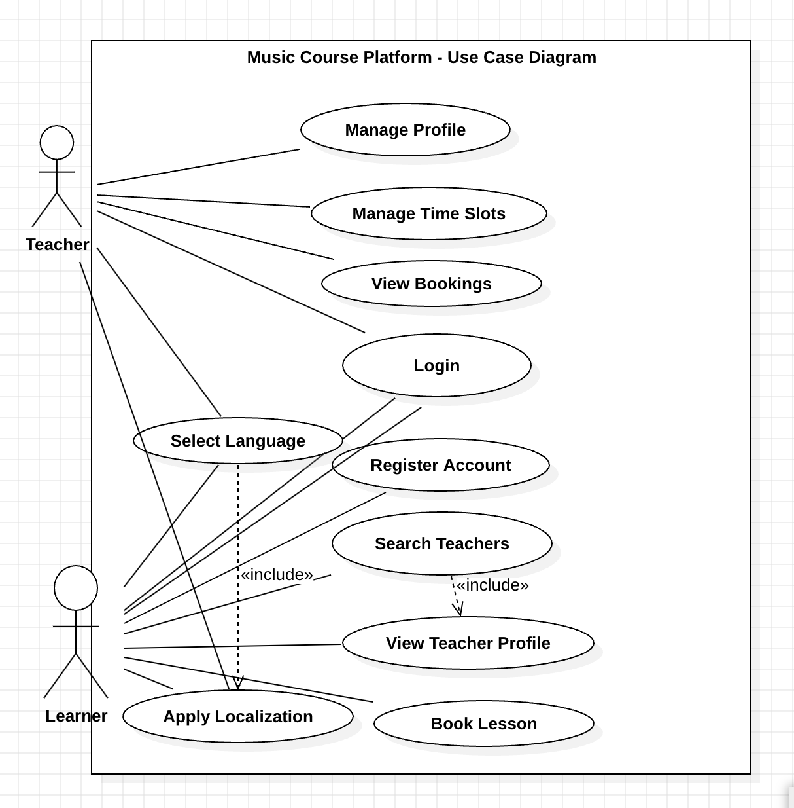
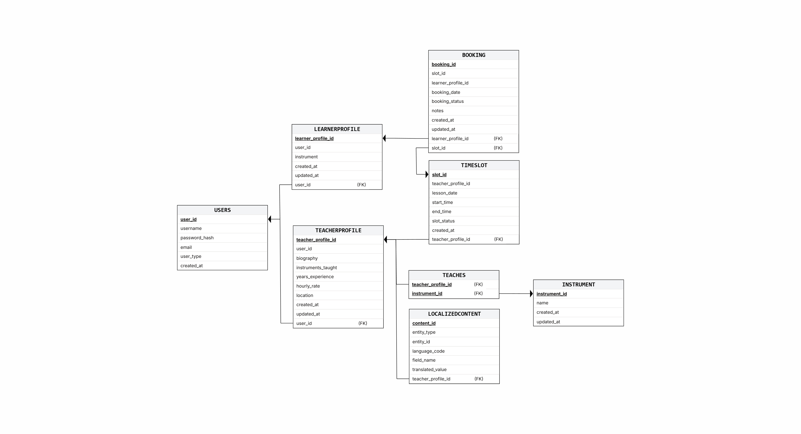
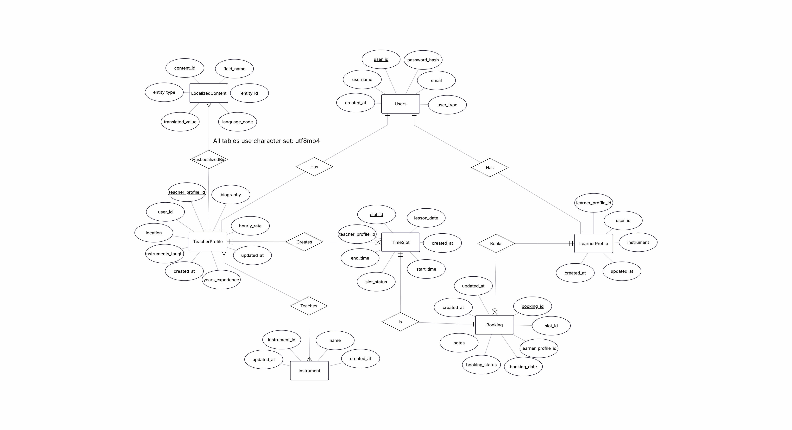
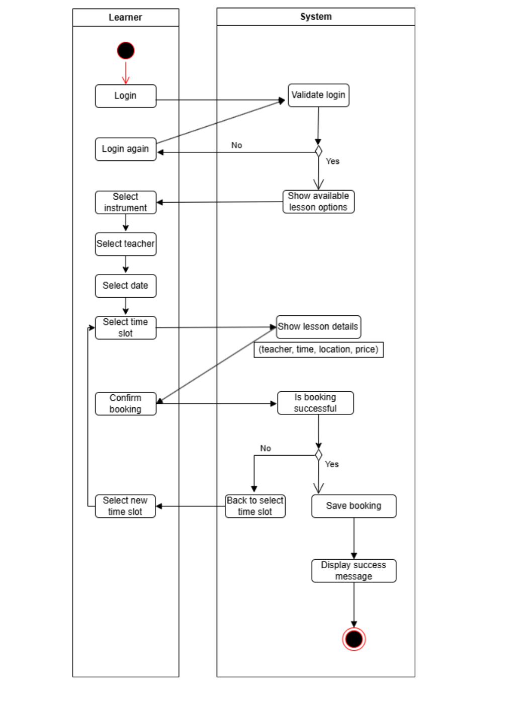
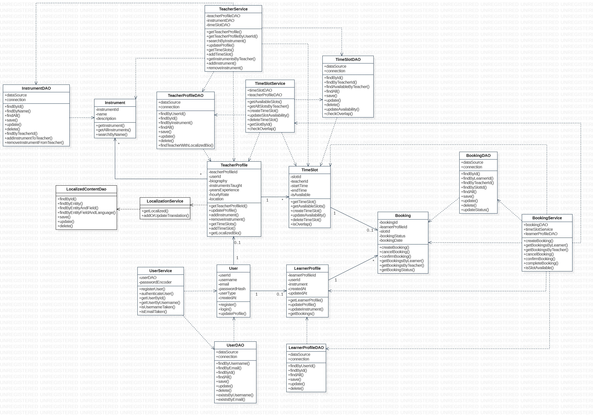
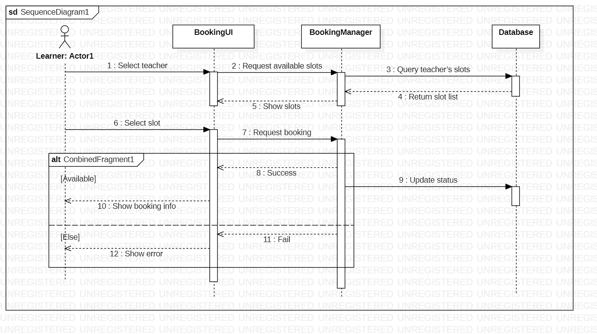
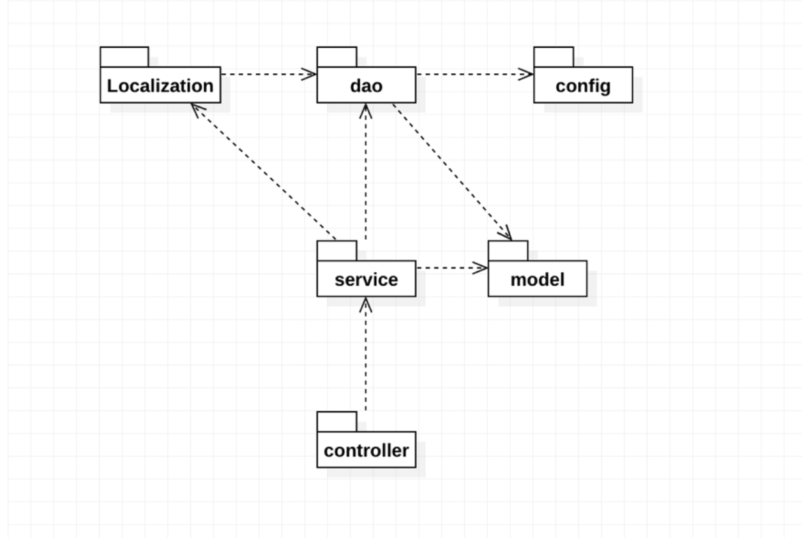
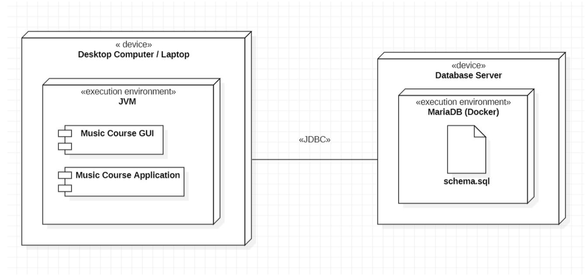

# Diagrams

Central index of modelling images (files live in `document/images/`). The [root README](../README.md#12-diagrams--modelling) embeds the **ER** and **activity** diagrams in **§12. Diagrams & modelling**; this file lists every figure (including those two) for reports and hand-ins.

## Use Case Diagram (with localization)

## Database schema

## ER diagram (project modelling)

## Activity diagram

## Class diagram

## Sequence diagram

## Package diagram

## Deployment diagram

