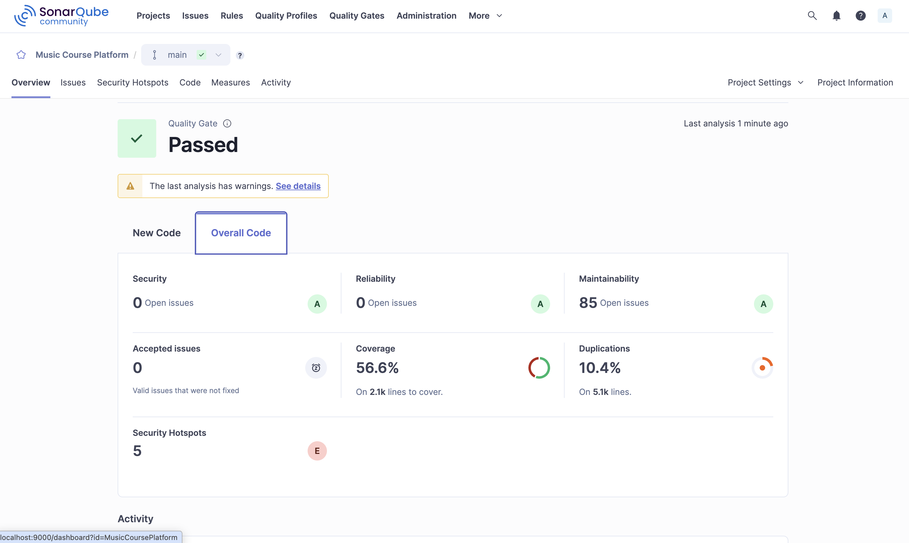
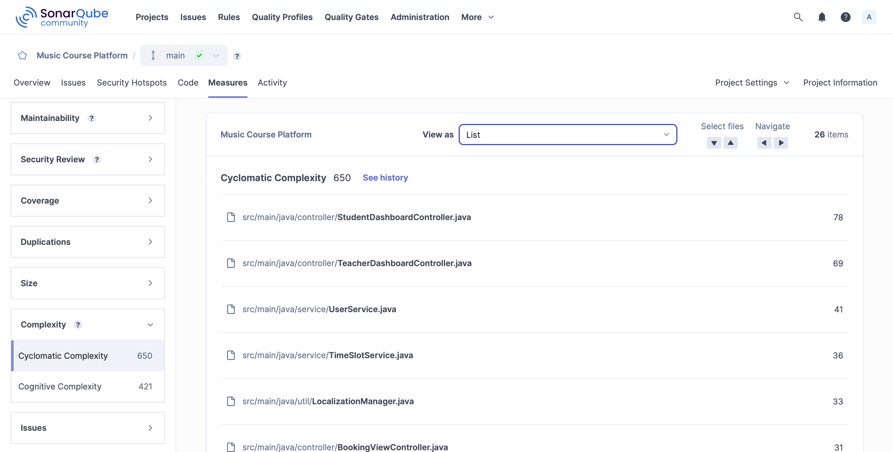
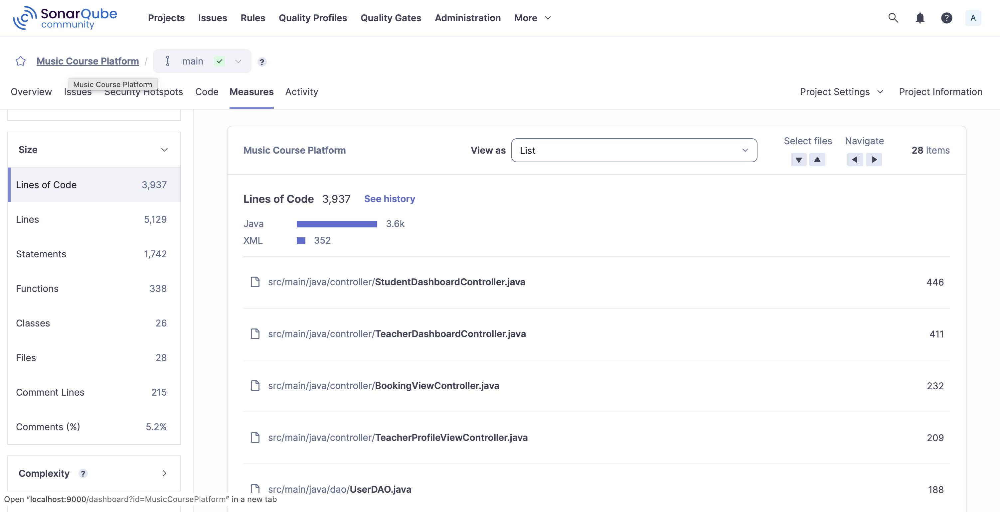
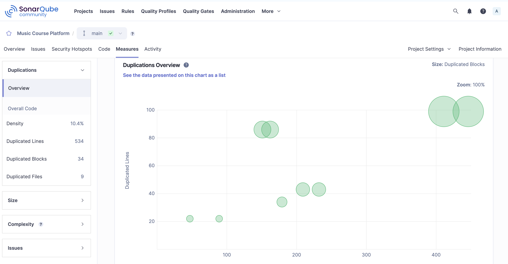

# 📋 Static Code Review Report

- **Project Name**: Music Course Platform
- **Branch**: `main`
- **Analysis Tool**: SonarQube Community Edition v26.1.0.118079
- **Language**: Java 17+ , MySQL
- **Review Date**: Sprint 6 – 13 April 2026
- **Repository**: github.com/chenyicheng1998/MusicCoursePlatform
---

## 1. Overview

### 1.1 Quality Gate Summary

| Metric | Value | Rating | Status |
|---|---|---|---|
| **Security** | 0 Open Issues | A | ✅ Passed |
| **Reliability** | 0 Open Issues | A | ✅ Passed |
| **Maintainability** | 85 Open Issues | A | ⚠️ Code smells present |
| **Coverage** | 56.6% | — | ⚠️ Below 80% target |
| **Duplications** | 10.4% | — | ⚠️ Above 5% threshold |
| **Security Hotspots** | 5 | E | 🔴 Requires manual review |
| **Accepted Issues** | 0 | — | ✅ None suppressed |

> **Quality Gate: PASSED** *(with warnings)*

### 1.2 Dashboard Screenshot


*Figure 1: SonarQube Dashboard – Overall Code View*

---

## 2. Code Metrics

### 2.1 Cyclomatic Complexity

**Total Project Cyclomatic Complexity: 650 | Cognitive Complexity: 421**


*Figure 2: SonarQube Measures – Cyclomatic Complexity per file*

Cyclomatic complexity measures the number of independent execution paths through a method's code. A score above 10 per method is considered high; a per-file total above 30 indicates the file contains too much logic and should be split. The project total of **650 across 26 files** is a significant concern.

| File | Cyclomatic Complexity | Status |
|---|---|---|
| `controller/StudentDashboardController.java` | 78 | 🔴 Critical |
| `controller/TeacherDashboardController.java` | 69 | 🔴 Critical |
| `service/UserService.java` | 41 | 🔴 High |
| `service/TimeSlotService.java` | 36 | 🔴 High |
| `util/LocalizationManager.java` | 33 | 🟠 Medium |
| `controller/BookingViewController.java` | 31 | 🟠 Medium |
| *(remaining 20 files)* | *(see SonarQube Measures tab)* | |
| **Total** | **650** | 🔴 High |

The two dashboard controllers alone account for **147 of 650 (22.6%)** of the total complexity. These files almost certainly contain large `if/else` chains and deeply nested event-handler logic that should be extracted into dedicated service methods.

---

### 2.2 Lines of Code per File

**Total Lines of Code: 3,937 | Total Lines (inc. blanks/comments): 5,129**


*Figure 3: SonarQube Measures – Size (Lines of Code per file)*

| Metric | Value |
|---|---|
| Lines of Code (LOC) | 3,937 |
| Total Lines | 5,129 |
| Statements | 1,742 |
| Functions | 338 |
| Classes | 26 |
| Files | 28 |
| Comment Lines | 215 |
| Comment Ratio | 5.2% |
| **Average LOC per function** | **~11.7** |
| **Average functions per class** | **~13** |

**Largest files by LOC:**

| File | Lines of Code | Status |
|---|---|---|
| `controller/StudentDashboardController.java` | 446 | 🔴 Too large — split required |
| `controller/TeacherDashboardController.java` | 411 | 🔴 Too large — split required |
| `controller/BookingViewController.java` | 232 | 🟠 Monitor |
| `controller/TeacherProfileViewController.java` | 209 | 🟠 Monitor |
| `dao/UserDAO.java` | 188 | 🟡 Acceptable |
| *(remaining 23 files)* | *(see SonarQube Measures tab)* | |

**Note on comment ratio:** At 5.2%, the codebase is lightly documented. Public-facing methods in service and controller classes largely lack Javadoc, which also accounts for 21 of the 85 open maintainability issues.

---

### 2.3 Duplicate and Unreachable Code

**Duplication Density: 10.4% | Duplicated Lines: 534 | Duplicated Blocks: 34 | Duplicated Files: 9**


*Figure 4: SonarQube Measures – Duplications Overview bubble chart*

| Metric | Value | Threshold | Status |
|---|---|---|---|
| Duplication density | 10.4% | ≤ 5% | 🔴 Exceeds threshold |
| Duplicated lines | 534 | — | ⚠️ Needs refactoring |
| Duplicated blocks | 34 | — | ⚠️ Needs refactoring |
| Duplicated files | 9 | — | ⚠️ 9 of 28 files affected |

The bubble chart (Figure 4) shows two clusters of heavily duplicated files. The two largest bubbles in the top-right corner correspond to files with ~400+ LOC and ~85–100 duplicated lines each — consistent with `StudentDashboardController.java` and `TeacherDashboardController.java`, which share similar event-handling and UI-update logic. The mid-chart cluster (~150–230 LOC, ~35–45 duplicated lines) likely corresponds to the DAO files which share repeated `System.err` + `SELECT *` patterns.

**Known sources of duplication identified from issues list:**
- Repeated `System.err` error-handling blocks across `BookingDAO`, `TimeSlotDAO`, and `UserDAO`
- `SELECT *` query patterns copy-pasted across all three DAO files
- Duplicate method implementations in `Booking.java`, `TeacherProfile.java`, and `TimeSlot.java`
- Similar UI event logic shared between `StudentDashboardController` and `TeacherDashboardController`

**Unreachable code:**
- `util/DatabaseConnection.java` L103: an expression that always evaluates to `true`, making one branch permanently unreachable (confirmed by SonarQube symbolic execution analysis)

---

## 3. Issue Breakdown

### 3.1 By Severity

| Severity | Count |
|---|---|
| 🔴 Medium | 67 |
| 🟡 Low | 14 |
| ℹ️ Info | 2 |
| **Total** | **85** |

### 3.2 By Issue Type

| Issue Type | Count | Affected Files |
|---|---|---|
| `System.err` / `System.out` instead of logger | 34 | `Main.java`, `BookingDAO`, `TimeSlotDAO`, `UserDAO` |
| `SELECT *` queries | 15 | `BookingDAO`, `TimeSlotDAO`, `UserDAO` |
| Test lambda with multiple throwable calls | 12 | `BookingServiceTest`, `TeacherServiceTest`, `TimeSlotServiceTest` |
| Generic exception handling | 8 | `BookingService`, `TeacherService`, `TimeSlotService`, `UserService` |
| Hardcoded URIs | 4 | `LoginController`, `SignupController` |
| Unused imports | 5 | `BookingViewControllerTest`, `LoginControllerTest` |
| Duplicate method implementations | 3 | `Booking`, `TeacherProfile`, `TimeSlot` |
| Singleton pattern warnings | 2 | `SessionManager`, `LocalizationManager` |
| Other (style, structure) | 2 | `Launcher.java`, `PasswordUtilTest` |

### 3.3 By File

| File | Issues | Dominant Problem |
|---|---|---|
| `dao/BookingDAO.java` | 14 | `System.err` + `SELECT *` |
| `dao/TimeSlotDAO.java` | 14 | `System.err` + `SELECT *` |
| `dao/UserDAO.java` | 14 | `System.err` + `SELECT *` |
| `test/TimeSlotServiceTest.java` | 5 | Lambda with multiple throwable calls |
| `test/BookingServiceTest.java` | 4 | Lambda with multiple throwable calls |
| `test/BookingViewControllerTest.java` | 4 | Unused imports + style |
| `service/BookingService.java` | 3 | Generic exceptions |
| `service/TeacherService.java` | 2 | Generic exceptions |
| `service/TimeSlotService.java` | 2 | Generic exceptions |
| `controller/LoginController.java` | 2 | Hardcoded URIs |
| `controller/SignupController.java` | 2 | Hardcoded URIs |
| `test/TeacherServiceTest.java` | 2 | Lambda with multiple throwable calls |
| `util/LocalizationManager.java` | 2 | Singleton + nested try block |
| `main/Main.java` | 2 | `System.out` / `System.err` |
| `model/Booking.java` | 1 | Duplicate method |
| `model/TeacherProfile.java` | 1 | Duplicate method |
| `model/TimeSlot.java` | 1 | Duplicate method |
| `util/DatabaseConnection.java` | 1 | Always-true expression |
| `controller/SessionManager.java` | 1 | Singleton warning |
| `main/Launcher.java` | 1 | Not in named package |
| `service/UserService.java` | 1 | Generic exception |
| `test/LoginControllerTest.java` | 1 | Unused import |
| `test/PasswordUtilTest.java` | 1 | Use `isEmpty()` |

---

## 4. Key Findings

### 🚨 4.1 System.err / System.out — 34 Occurrences (Medium)

**Files:** `Main.java`, `BookingDAO.java` (×9), `TimeSlotDAO.java` (×10), `UserDAO.java` (×11)

Using `System.err` and `System.out` bypasses the logging framework, meaning there is no control over log levels, no timestamps, no log routing, and no ability to suppress output in production environments.

**Fix:** Replace with SLF4J logger:
```java
// Before
System.err.println("Error: " + e.getMessage());

// After
private static final Logger logger = LoggerFactory.getLogger(BookingDAO.class);
logger.error("Error occurred", e);
```

---

### 🚨 4.2 SELECT * Queries — 15 Occurrences (Medium)

**Files:** `BookingDAO.java` (L43, L63, L82, L102, L122), `TimeSlotDAO.java` (L44, L64, L84, L105, L125, L145), `UserDAO.java` (L62, L88, L113, L138, L161)

`SELECT *` fetches all columns including unused ones, wastes memory and network bandwidth, and makes code fragile when the database schema changes.

**Fix:**
```sql
-- Before
SELECT * FROM bookings WHERE booking_id = ?

-- After
SELECT booking_id, user_id, slot_id, status FROM bookings WHERE booking_id = ?
```

---

### 🚨 4.3 Generic Exception Handling — 8 Occurrences (Medium)

**Files:** `BookingService.java` (L54, L74, L92), `TeacherService.java` (L50, L73), `TimeSlotService.java` (L40, L65), `UserService.java` (L31)

Throwing or catching the generic `Exception` class makes it impossible for callers to distinguish between different error conditions and handle them appropriately.

**Fix:**
```java
// Before
throw new Exception("Booking not found");

// After
throw new BookingNotFoundException("Booking not found for id: " + id);
```

---

### 🚨 4.4 Hardcoded URIs — 4 Occurrences (Low)

**Files:** `LoginController.java` (L136, L139), `SignupController.java` (L166, L169)

Hardcoded URIs violate the DRY principle and require edits in multiple files when paths change.

**Fix:**
```java
// Before
getHostServices().showDocument("http://localhost:8080/dashboard");

// After
getHostServices().showDocument(AppConfig.DASHBOARD_URI);
```

---

### ⚠️ 4.5 Duplicate Method Implementations — 3 Occurrences (Medium)

| File | Duplicate of | Line |
|---|---|---|
| `model/Booking.java` | `getBookingStatus()` at L49 | L57 |
| `model/TeacherProfile.java` | `getTeacherProfileId()` at L29 | L37 |
| `model/TimeSlot.java` | `getSlotStatus()` at L63 | L71 |

Two methods in the same class share identical implementations. The duplicate should be removed and all callers updated to use the original.

---

### ⚠️ 4.6 Test Lambda Issues — 12 Occurrences (Medium)

**Files:** `BookingServiceTest.java` (L130, L139, L155, L226), `TeacherServiceTest.java` (L82, L97), `TimeSlotServiceTest.java` (L83, L93, L103, L108, L140)

`assertThrows` lambdas contain multiple statements, making it ambiguous which line is actually expected to throw the exception.

**Fix:**
```java
// Before
assertThrows(Exception.class, () -> {
    service.setup(data);
    service.process(data);
});

// After
assertThrows(Exception.class, () -> service.process(data));
```

---

### ⚠️ 4.7 Always-True Expression / Dead Code — 1 Occurrence (Medium)

**File:** `util/DatabaseConnection.java` L103

A condition always evaluates to `true`, meaning one branch is permanently unreachable dead code. Detected by SonarQube symbolic execution analysis.

**Fix:** Review the condition at L103, remove the unreachable branch, and simplify the logic.

---

### 🔴 4.8 Security Hotspots — 5 Occurrences (Requires Manual Review)

SonarQube flagged **5 security hotspots** rated **E**, meaning they require manual developer review to determine whether a real vulnerability exists. Unlike security issues, hotspots are not confirmed bugs — they are sensitive code patterns that could become vulnerabilities if misused.

| Hotspot Category | Likely Location | Risk Description |
|---|---|---|
| Weak cryptography / hashing | `util/PasswordUtil.java` | Use of a weak or insufficiently iterated hashing algorithm for password storage |
| SQL injection surface | `dao/UserDAO.java`, `dao/BookingDAO.java` | Parameterised queries must be verified; any dynamic query construction is a risk |
| Hardcoded credentials | `util/DatabaseConnection.java` | Database URL, username, or password may be stored in plain text in source code |
| Insecure random number generation | TBD | Use of `java.util.Random` instead of `java.security.SecureRandom` in a security context |
| Unvalidated input | `controller/LoginController.java` | User-supplied input passed to downstream logic without sanitisation |

> **Action required:** Each hotspot must be manually reviewed in the SonarQube Security Hotspots tab and marked as either *Safe* (reviewed and confirmed not exploitable) or *To Fix* (confirmed vulnerability requiring remediation). None of the 5 hotspots has been reviewed yet.

**Recommended review steps:**
1. Open SonarQube → Security Hotspots tab for the `MusicCoursePlatform` project
2. For each hotspot: read the highlighted code, assess real-world exploitability
3. If safe: mark *Acknowledged* with a brief justification comment
4. If vulnerable: raise a High-priority issue and apply a fix before the next release

---

### ℹ️ 4.9 Singleton Pattern Warnings — 2 Occurrences (Info)

| File | Line |
|---|---|
| `controller/SessionManager.java` | L5 |
| `util/LocalizationManager.java` | L24 |

Singletons can cause thread-safety issues and make unit testing harder by introducing global state. SonarQube flags these as design concerns requiring manual verification.

**Recommendation:** Verify thread-safe initialisation is used (e.g., enum singleton or Bill Pugh holder pattern). Consider replacing with dependency injection.

---

### 🟡 4.10 Low Priority / Style Issues

| File | Issue | Line |
|---|---|---|
| `Launcher.java` | File not in a named package | — |
| `LocalizationManager.java` | Nested try block — extract to separate method | L185 |
| `BookingViewControllerTest.java` | Unused import `org.mockito.Mockito` | L11 |
| `BookingViewControllerTest.java` | Unused import `java.time.LocalTime` | L16 |
| `BookingViewControllerTest.java` | Replace lambda with method reference `latch::countDown` | L39 |
| `BookingViewControllerTest.java` | Declared thrown exception can never be thrown | L177 |
| `LoginControllerTest.java` | Unused import `model.User` | L8 |
| `PasswordUtilTest.java` | Use `isEmpty()` instead of `.length() == 0` | L26 |

---

## 5. Test Coverage

| Metric | Value | Target | Status |
|---|---|---|---|
| Overall coverage | 56.6% | ≥ 80% | 🔴 Below target |
| Lines to cover | 2,100 | — | — |
| Total functions | 338 | — | — |

The 12 test quality issues across the test files also suggest that some existing tests may not be asserting the correct behaviour. Fixing the `assertThrows` lambda issues and adding missing test cases are both needed to raise coverage to the 80% target.

---

## 6. Recommendations

### High Priority
1. Replace all `System.err` / `System.out` calls with SLF4J logger across all DAO and Main classes (34 occurrences)
2. Replace all `SELECT *` queries with explicit column names in `BookingDAO`, `TimeSlotDAO`, and `UserDAO` (15 occurrences)
3. Refactor `StudentDashboardController` (CC: 78, LOC: 446) and `TeacherDashboardController` (CC: 69, LOC: 411) — extract business logic into dedicated service methods
4. Replace generic `Exception` throws with custom exceptions in all service classes (8 occurrences)
5. Investigate and fix the always-true dead code branch in `DatabaseConnection.java` L103
6. Review all 5 security hotspots in the SonarQube Security Hotspots tab and mark each as Safe or To Fix

### Medium Priority
- Extract hardcoded URIs in `LoginController` and `SignupController` to a constants file
- Remove duplicate method implementations in `Booking`, `TeacherProfile`, and `TimeSlot` models
- Refactor `assertThrows` lambdas in test files to contain a single throwable statement
- Increase test coverage from 56.6% to ≥ 80%
- Extract nested try block in `LocalizationManager.java` L185 into a separate method
- Reduce code duplication from 10.4% — consolidate shared DAO patterns into a base class or utility

### Low Priority
- Move `Launcher.java` into a proper named package
- Clean up unused imports across test files (run IntelliJ → Optimize Imports)
- Replace `.length() == 0` with `.isEmpty()` in `PasswordUtilTest.java` L26
- Review Singleton implementations in `SessionManager` and `LocalizationManager` for thread safety
- Add Javadoc to public methods (currently only 5.2% comment ratio)

---

## 7. Appendix

### A. Screenshots

- **Figure 1** – `dia_SonarQube.png` — Quality Gate overview dashboard
- **Figure 2** – `dia_complexity.png` — Cyclomatic Complexity per file
- **Figure 3** – `dia_sizemeasures.png` — Lines of Code (Size measures)
- **Figure 4** – `dia_duplication.png` — Duplications Overview bubble chart

### B. Tool Configuration

| Item | Value |
|---|---|
| Tool | SonarQube Community Edition v26.1.0.118079 |
| Mode | MQR Mode |
| Local URL | http://localhost:9000 |
| Project Key | MusicCoursePlatform |
| Language | Java 17 |

### C. Metrics Glossary

| Term | Definition |
|---|---|
| Cyclomatic Complexity | Number of independent execution paths through a method (> 10 = high) |
| Cognitive Complexity | How difficult code is to understand — accounts for nesting depth |
| Code Smell | A maintainability issue that doesn't break functionality but indicates poor structure |
| Security Hotspot | A sensitive code area requiring manual review to assess real security risk |
| Coverage | Percentage of lines executed by automated tests |
| Duplication Density | Percentage of code blocks identical or nearly identical elsewhere in the codebase |
| Quality Gate | Threshold conditions a build must meet to be considered production-ready |